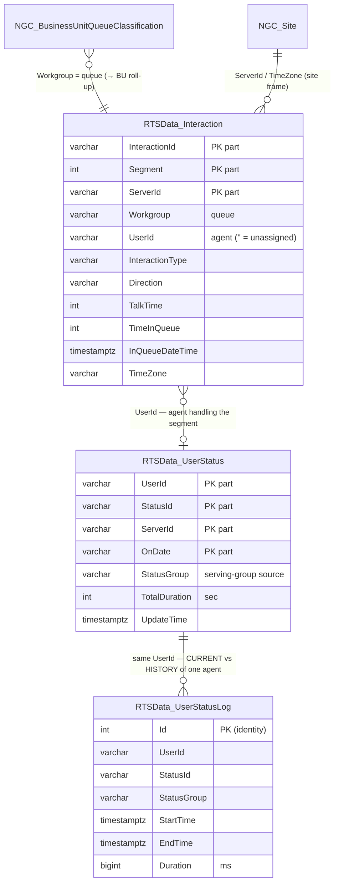

# RTM View Shell — Data Reference
## RTSData interaction / agent-status tables

> Source of truth: `db/schema.sql` (DDL) + `db/functions/02_rtsdata_functions.sql` (write/read routines) + RTM engine value literals.
> Tables: `RTSData_Interaction`, `RTSData_UserStatus`, `RTSData_UserStatusLog`. ("User" = agent throughout.)

---

## 1. ERD

Relationships are **logical** — these real-time tables are denormalized and joined by **string keys**, with no enforced foreign keys (RTM writes fast, keys are external CC ids).

**Composite natural keys** (upsert targets):
- `RTSData_Interaction` → `(InteractionId, Segment, ServerId)` — unique index `IX_RTSData_Interaction_UpsertKey`.
- `RTSData_UserStatus` → `(UserId, StatusId, ServerId, OnDate)`.
- `RTSData_UserStatusLog` → surrogate `Id` (append-only; no natural upsert).

---

## 2. Write / lifecycle semantics

| Table | Written by | Mode | Lifecycle |
|---|---|---|---|
| `RTSData_Interaction` | `RTSData_SetInteraction` | **UPSERT** on `(InteractionId, Segment, ServerId)` | Live + today's rows; wiped daily by the midnight-clear routine |
| `RTSData_UserStatus` | `RTSData_SetUserStatus` (snapshot part) | **UPSERT** on `(UserId, StatusId, ServerId, OnDate)` | **Current** state only; wiped daily by the midnight-clear routine |
| `RTSData_UserStatusLog` | `RTSData_SetUserStatus` (interval part) | **APPEND-ONLY**; a row is inserted only when `StartTime`+`EndTime` present and `EndTime > StartTime` | **Durable history**; NOT cleared at midnight |

`RTSData_UserStatus` = "where each agent is **right now**" (one row, overwritten). `RTSData_UserStatusLog` = "**how long** each agent spent in each status" (one row per completed interval, kept) — the durable source for historical staffing.

---

## 3. `RTSData_Interaction` — one row per interaction **segment**

| Column | Type | Possible values / description |
|---|---|---|
| `InteractionId` | varchar(50) **NN** | External CC-platform interaction/call id (opaque string). **PK part.** |
| `Segment` | int **NN** | Segment index within the interaction: `0` = original leg; `1, 2, …` added by each transfer / conference leg. **PK part.** |
| `OnDate` | varchar(50) **NN** | Server-local **business-day string** (e.g. `2026-07-22`). Scope key — **not** a timestamp; never time-filter on it. **PK part.** |
| `ServerId` | varchar(50) **NN** | RTM/CC server-node / site code (e.g. `IL`). **PK part.** |
| `Workgroup` | varchar(100) **NN** | Queue name (== QueueId in the model). Examples: `DE - Support`, `US - Onboarding`, `Callbacks`, `Everyone`. |
| `UserId` | varchar(50) **NN, dflt ''** | Agent login/id handling the segment; **`''` (empty)** while unassigned / still in queue. |
| `ClassificationCode` | text | Classification / disposition code (adapter-defined; nullable). |
| `InteractionType` | varchar(50) | `Call` · `Callback` · `Chat` · `Email`. (Chat/Email also flagged by `IsMessaging=true`.) |
| `CallType` | varchar(50) | `External` · `Internal`. |
| `Direction` | varchar(50) | `Incoming` · `Outgoing`. (Realized callbacks are `Outgoing`.) |
| `CustomCallData` | text | Primary attached-data slot (adapter/customer payload; nullable). |
| `IsTransferred` | bool | `true` if this segment was transferred; else `false`/`null`. |
| `IsAnswered` | bool | `true` once answered by an agent. |
| `IsInQueue` | bool | `true` while waiting in queue (not yet answered). |
| `IsTalk` | bool | `true` while in active talk. |
| `IsAbandoned` | bool | `true` if the caller hung up before answer. |
| `TimeInQueue` | int | Seconds spent waiting in queue (≥ 0). |
| `TalkTime` | int | Talk duration, **seconds** (≥ 0). WFM AHT source — **talk only**, no separate hold/wrap column → AHT is `wrapIncluded=false`. |
| `InQueueDateTime` | timestamptz | When it entered the queue. ⚠ Stamped as `UtcNow + site-offset`, stored `SpecifyKind(Utc)` (local wall-time labelled UTC — see §6.2). |
| `AnsweredDateTime` | timestamptz | When answered (same stamping convention); `null` if never answered. |
| `UpdateTime` | timestamptz | Last write time for the row. |
| `LastUserId` | varchar(50) | Previous agent (after a transfer); nullable. |
| `LastWorkgroup` | varchar(100) | Previous queue (after a transfer); nullable. |
| `IsMessaging` | bool | `true` for chat/email channels (vs voice). |
| `RemoteAddress` | varchar(50) | ANI / remote-party address (e.g. phone number); nullable. |
| `IsCallbackRequest` | bool | `true` on the **original inbound Call** when it is deflected to a callback (the realized callback is a separate `Outgoing` row). λ dedup marker: 1 arrival, not 2. |
| `TimeZone` | varchar(10) | Per-row site TZ offset used to stamp the datetimes. Examples: `+02:00`, `-04:00`, `+00:00`, `+12:00`; occasionally an IANA name; can be **misconfigured** (e.g. DE `-01:00`) but stays self-consistent with the stamp. |
| `CustomCallData1` … `CustomCallData20` | text × 20 | 20 additional attached-data slots (`customCallData1..20` from the adapter); each nullable. |

---

## 4. `RTSData_UserStatus` — CURRENT agent-status snapshot

| Column | Type | Possible values / description |
|---|---|---|
| `UserId` | varchar(100) **NN** | Agent login/id. **PK part.** |
| `StatusId` | varchar(100) **NN** | Raw status code from the CC platform. **PK part.** |
| `ServerId` | varchar(50) **NN** | RTM/CC server-node / site code. **PK part.** |
| `OnDate` | varchar(50) **NN** | Server-local business-day string. **PK part.** |
| `StatusName` | varchar(100) | Granular per-state name. Examples seen live: `Available`, `Incoming Ext Call`, `Ringing`, `Back Office`, `Meeting`, `Callback Outgoing`, `Callback Incoming`, `Special Projects`, `Unavailable`, `Lunch`, `Training`. |
| `StatusGroup` | varchar(100) | Canonical status **group** the state rolls up to — the WFM "serving-groups" (N) source. Canonical groups: **`AVAILABLE`** · **`ONPHONE`** · **`PAPERWORK`** · **`BREAK`** · **`TRAINING`** · **`UNAVAILABLE`**. (May also appear title-cased in some configs: `Available`, `On Phone`, `Paperwork`, `Break`, `Training`, `Unavailable`.) |
| `TotalDuration` | int | Cumulative **seconds** in this status today (≥ 0). |
| `MaxDuraction` | int | Max single-occurrence duration, **seconds**. ⚠ Column name is misspelled `MaxDuraction` in the schema — keep as-is. |
| `TotalCount` | int | Number of times the agent entered this status today (≥ 0). |
| `UpdateTime` | timestamptz | Last update. |
| `DisplayName` | varchar(100) | Agent display name (e.g. `Mirna Barakat`). |
| `TimeZone` | varchar(10) | Per-row site TZ offset (as in §3). |

---

## 5. `RTSData_UserStatusLog` — agent-status INTERVAL history (append-only)

One row per **completed** status interval. NOT cleared at midnight → durable source for historical staffing (e.g. the planned WFM Graph).

| Column | Type | Possible values / description |
|---|---|---|
| `Id` | int **IDENTITY, PK** | Surrogate auto-increment key (`1, 2, …`). |
| `UserId` | varchar(100) | Agent login/id. |
| `StatusId` | varchar(100) | Raw status code for the interval. |
| `ServerId` | varchar(50) | RTM/CC server-node / site code. |
| `OnDate` | varchar(50) | Server-local business-day string. |
| `StartTime` | timestamptz | Interval start. |
| `EndTime` | timestamptz | Interval end (`> StartTime`; a row is only written once the interval is closed). |
| `Duration` | bigint | Interval length in **milliseconds** = `(EndTime − StartTime) × 1000`. ⚠ **Milliseconds here** vs **seconds** in `RTSData_UserStatus.TotalDuration`. |
| `UpdateTime` | timestamptz | Write time. |
| `TimeZone` | varchar(10) | Per-row site TZ offset. |
| `StatusGroup` | varchar(50) | Canonical group of the interval (`AVAILABLE`/`ONPHONE`/`PAPERWORK`/`BREAK`/`TRAINING`/`UNAVAILABLE`). Note: `varchar(50)` here vs `varchar(100)` on `UserStatus.StatusGroup`. |

---

## 6. Notes / gotchas

1. **`OnDate` is `varchar`, not a date** — a business-day scope key. Never filter time ranges on it; use the `timestamptz` columns (`InQueueDateTime` / `AnsweredDateTime` / `UpdateTime` / `StartTime` / `EndTime`).
2. **Timezone stamping** — `InQueueDateTime` / `AnsweredDateTime` hold **site-local wall time labelled as UTC** (`UtcNow + TimeZone-offset`, `SpecifyKind(Utc)`). Any windowing must frame with the row's own `TimeZone` to stay self-consistent. A wrong site offset (e.g. DE `-01:00`) is self-consistent for windowing but skews cross-TZ display.
3. **Current vs history** — `RTSData_UserStatus` cannot answer "how many agents were serving at time T" (current only). Use `RTSData_UserStatusLog` interval overlap. This is the key dependency for historical staffing views.
4. **Duration units differ** — `RTSData_UserStatusLog.Duration` = **ms**; `RTSData_UserStatus.TotalDuration` / `MaxDuraction` = **seconds**.
5. **Midnight clear** wipes `RTSData_Interaction` + `RTSData_UserStatus` daily; the **Log survives**. Live views reset at the business-day boundary; interval history persists.
6. **Callback dedup** — a deflected call keeps ONE `Incoming` row with `IsCallbackRequest=true`; the executed callback is a separate `Outgoing` row → arrivals (λ) filter `Direction='Incoming'` to avoid double-counting.
7. **Serving-group ↔ state mapping** — `StatusName` (granular, e.g. `Incoming Ext Call`, `Back Office`) rolls up to `StatusGroup` (canonical, e.g. `ONPHONE`, `PAPERWORK`). Which `StatusGroup`s count as "serving" is per-deployment WFM config.
8. **Schema quirks to preserve** — `MaxDuraction` (typo); `StatusGroup` width mismatch (`varchar(50)` in Log vs `varchar(100)` in UserStatus).
