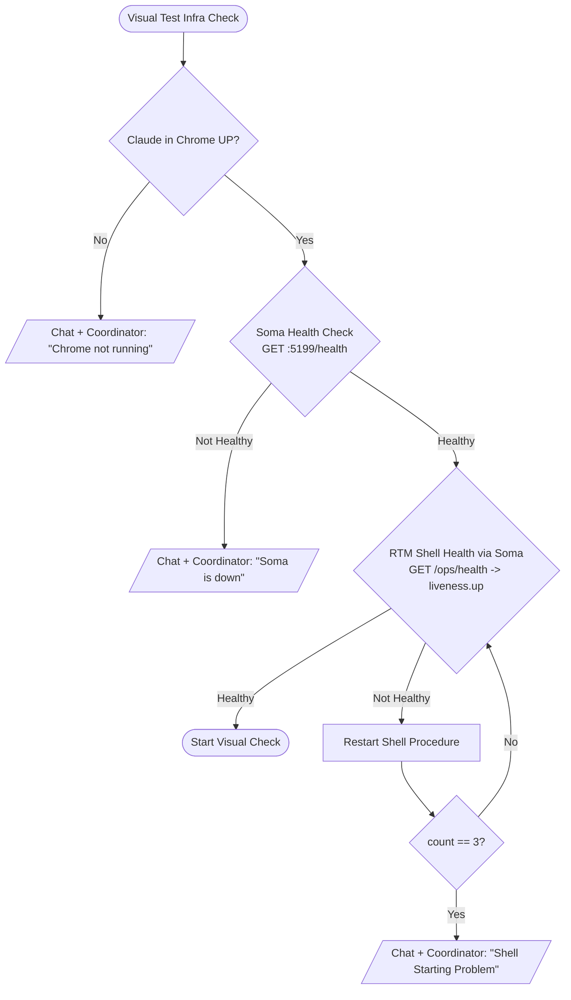
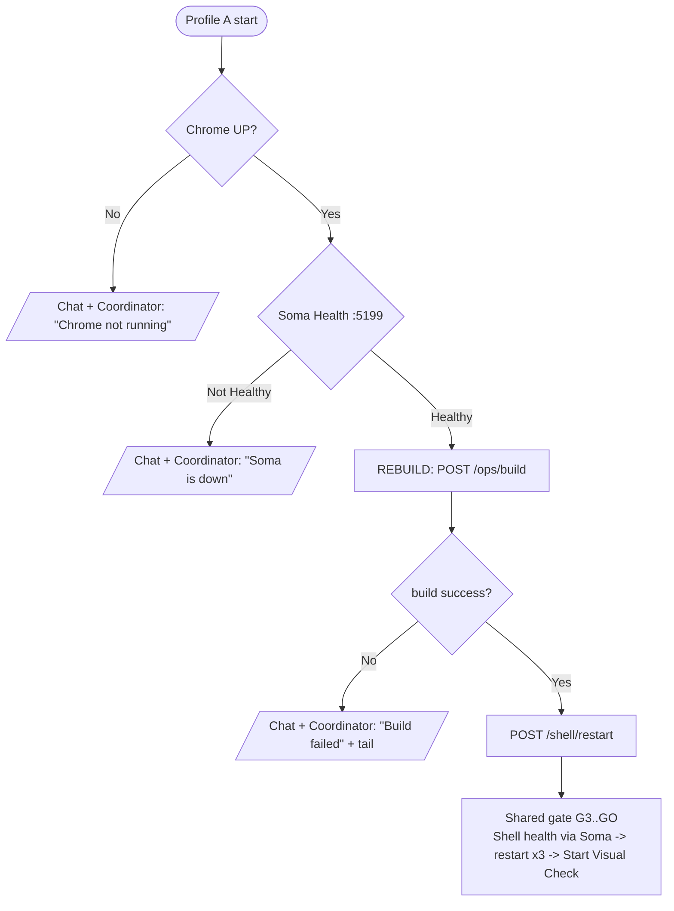

# Visual Test Preflight — Canonical Procedure

> **Owner:** devops · **Status:** canonical · **Applies to:** any session running visual (UI) checks
> of the RTM View Shell via Claude-in-Chrome, using Soma as the ops bridge (CLAUDE.md §47).
>
> **Two design decisions (flag devops to change):**
> 1. **Rebuild step = explicit `POST /ops/build`** (full `CcDashboard.sln` build — surfaces compile
>    errors with a clear message BEFORE touching the running Shell) followed by `POST /shell/restart`.
> 2. **Doc home = `docs/`** (canonical docs tree); doc-governance lands via coordinator/techwriter.

---

## 1. Purpose & scope

This runbook defines the **preflight gate** that MUST pass before any visual check is started, plus
two execution **profiles**:

| Profile | Name | When to use |
|---|---|---|
| **A** | **Visual check WITH preliminary rebuild** | Validating UI changes that were just committed/edited — the running Shell must serve the NEW code first. |
| **B** | **Visual check on CURRENT version** | Regression / smoke on whatever is already running — no rebuild, no forced restart. |

Both profiles run the **same** preflight gate (Section 3). Profile A inserts a **build + restart**
step (Section 4) before the gate. The gate mirrors the approved flowchart: Chrome up → Soma healthy
→ Shell healthy via Soma → (restart ×3 if needed) → Start Visual Check.

## 2. Actors, prerequisites, access

- **Executor:** a Cowork session (e.g. shell / QA) that drives both the visual check and Soma.
- **Claude-in-Chrome** must be UP — it is required BOTH to run the visual check AND to reach Soma.
  A Cowork session CANNOT reach the host loopback from its bash sandbox; it calls Soma through the
  **host Chrome** via same-origin `fetch('/<endpoint>')` with `Authorization: Bearer <token>`
  (token from `tools/Soma/appsettings.json`, `Soma:Token` — **never echo, log, or commit it**).
- **Soma** = operator-managed daemon on `http://127.0.0.1:5199`. Roles do NOT start Soma themselves
  (§47) — if down, escalate to the operator.

> **Port caution (recurring confusion):** Soma's OWN liveness is `http://localhost:5199/health`
> (no auth). `5238` is the **Shell's** dev HTTP port (`Soma:Shell.HealthUrl`), the URL Soma PROBES
> to check the Shell — Soma does NOT listen on 5238. **Never probe 5238 to verify Soma.**
> See `tools/Soma/USAGE.md`.

## 3. Canonical preflight gate (shared by A and B)



### Step-by-step

| # | Check | Soma call | PASS condition | On FAIL |
|---|---|---|---|---|
| G1 | **Claude in Chrome UP** | (the Chrome MCP itself) | Chrome connected, a tab can `fetch` | **STOP** → Chat + Coordinator: *"Chrome not running"* |
| G2 | **Soma Health** | `GET http://localhost:5199/health` (no auth) | HTTP 200 + `{ok:true, service:"Soma"}` | **STOP** → Chat + Coordinator: *"Soma is down"* (operator must restart — §47) |
| G3 | **RTM Shell Health via Soma** | `GET /ops/health` (Bearer) | `liveness.up == true` | → **Restart Shell Procedure** (G4) |
| G4 | **Restart Shell Procedure** | see Section 5 | Shell becomes healthy within the attempt | re-check G3; after **3** attempts still not healthy → **STOP** → Chat + Coordinator: *"Shell Starting Problem"* |
| GO | **Start Visual Check** | — | (gate passed) | run the visual check |

**Notes:**
- G3 uses `liveness.up` (Shell `/health` = app alive). If the visual check needs DB/Redis-backed
  pages, ALSO require `readiness.up == true` (Shell `/health/ready` = PG + Redis). `readiness.up:false`
  with `liveness.up:true` usually = Redis/Memurai down, not a Shell-code fault.
- The 3-attempt counter is per preflight run; reset it at the start of each run.

## 4. Profile A — Visual check WITH preliminary rebuild

Use when the running Shell must reflect freshly changed code.



**Profile A sequence:**
1. G1 (Chrome) and G2 (Soma) from Section 3 — same STOP/escalation on fail.
2. **Rebuild:** `POST /ops/build` (Bearer). PASS = `success == true` (`exitCode == 0`).
   - On `success == false`: **STOP** → Chat + Coordinator: *"Build failed"* + include the `tail[]`
     (last build output lines) for diagnosis. Do NOT proceed to a visual check on a broken build.
   - `freedOrphans` in the response is expected/benign (orphan-Shell cleanup; the F-QA-4 kill-guard,
     commit `7ce8825`, guarantees `/ops/build` and `/ops/test` never kill Soma itself).
3. **Reload new binaries:** `POST /shell/restart` (Bearer). This frees port 5239, starts the Shell,
   and polls its health (up to ~60s). A cold `dotnet watch run` start can exceed 30s — do not declare
   failure early.
4. **Enter the shared gate at G3** (Shell health via Soma). If `/shell/restart` already returned
   `healthy:true`, G3 passes immediately; otherwise apply the Restart Shell Procedure (Section 5)
   with the 3-attempt limit, then Start Visual Check.

> If the Shell is configured to run via `dotnet watch run` (default `Soma:Shell.Args`), a `/shell/restart`
> already triggers an implicit recompile. The explicit `POST /ops/build` in step 2 is still run first
> because it surfaces compile errors with a clear PASS/FAIL **before** the running Shell is disturbed.

## 5. Restart Shell Procedure (the G4 sub-routine)

```
attempt = 1
while attempt <= 3:
    POST /shell/restart            # Bearer; frees 5239, starts Shell, polls health up to ~60s
    re-check G3: GET /ops/health -> liveness.up
    if liveness.up == true: PASS -> proceed to Start Visual Check
    attempt += 1
# fell through 3 attempts:
STOP -> Chat + Coordinator: "Shell Starting Problem"
       attach last GET /logs/tail?source=soma-shell&n=80 (Shell stdout/err)
       and  GET /logs/tail?source=serilog&n=40 (structured errors) for diagnosis
```

- `POST /shell/restart` is preferred over manual stop+start (atomic, frees the port, tracks the pid).
- If `/shell/start` reports `409 Conflict "Shell already running"` but G3 says not healthy, the tracked
  process is alive-but-unhealthy → use `/shell/restart` (it stops the tracked pid first).
- On the **"Shell Starting Problem"** escalation, always attach the two log tails above so devops can
  diagnose (port still held / build error / config / DB-down) without a round-trip.

## 6. Profile B — Visual check on CURRENT version

Use for regression / smoke on the already-running Shell. **No `/ops/build`, no forced restart.**

1. Run the shared preflight gate exactly as in Section 3 (G1 → G2 → G3 → G4×3 → GO).
2. A restart happens ONLY if G3 finds the Shell unhealthy (standard Restart Shell Procedure).
3. On GO, start the visual check against the current binaries.

Profile B is the default for routine VISUAL gates and the pre-push regression sweep
(`testing/regression_checklist.md`), where the running version is the version under test.

## 7. Escalation messages (canonical wording)

Each terminal failure node emits BOTH a chat line AND a `.coord/inbox/coordinator.md` message:

| Node | Message |
|---|---|
| Chrome down | `Visual preflight ABORTED — Chrome not running. Claude-in-Chrome is required for both the visual check and Soma access; (re)connect the Chrome extension.` |
| Soma down | `Visual preflight ABORTED — Soma is down (GET :5199/health failed). Roles do not start Soma (§47); operator restart required.` |
| Build failed (Profile A) | `Visual preflight ABORTED — build failed (/ops/build success=false, exitCode=<n>). Tail: <last lines>. Not running a visual check on a broken build.` |
| Shell starting problem | `Visual preflight ABORTED — Shell did not become healthy after 3 restart attempts. Tails attached (soma-shell, serilog). Devops diagnosis needed.` |

## 8. Reference — Soma endpoints used

| Endpoint | Auth | Purpose | Key fields |
|---|---|---|---|
| `GET /health` (:5199) | none | **Soma** liveness (G2) | `{ok, service:"Soma"}` |
| `GET /ops/health` | Bearer | **Shell** health via Soma (G3) | `liveness.up`, `readiness.up`, `latencyMs` |
| `POST /ops/build` | Bearer | Rebuild `CcDashboard.sln` (Profile A) | `success`, `exitCode`, `freedOrphans`, `tail[]` |
| `POST /shell/restart` | Bearer | Stop+start tracked Shell, frees 5239, polls health | `running`, `tracked`, `pid`, `healthy` |
| `POST /shell/start` | Bearer | Start Shell if not running | `running`, `tracked`, `pid`, `healthy` (or `409` if already running) |
| `GET /shell/status` | Bearer | Tracked-Shell status | `running`, `pid` |
| `GET /logs/tail?source=<soma-shell\|serilog\|soma-audit>&n=<N>` | Bearer | Diagnosis tails | log lines |

**Full endpoint catalog + call examples:** `tools/Soma/USAGE.md`.

---

*Revision history*

| Version | Date | Summary | Author |
|---|---|---|---|
| 1.0 | 2026-06-25 | Initial canonical preflight + Profiles A (rebuild) / B (current) from approved flowchart | devops-0624 |
