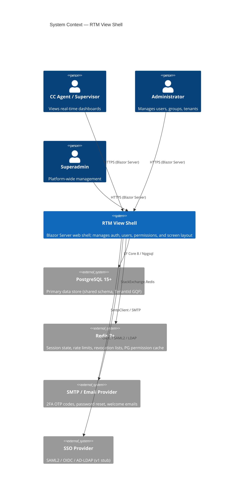
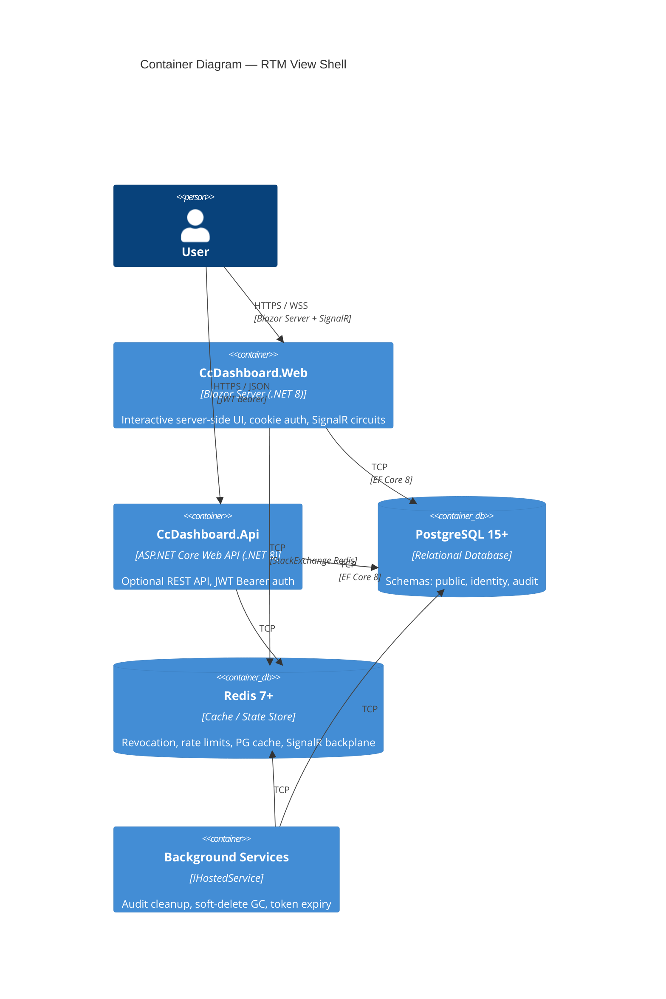
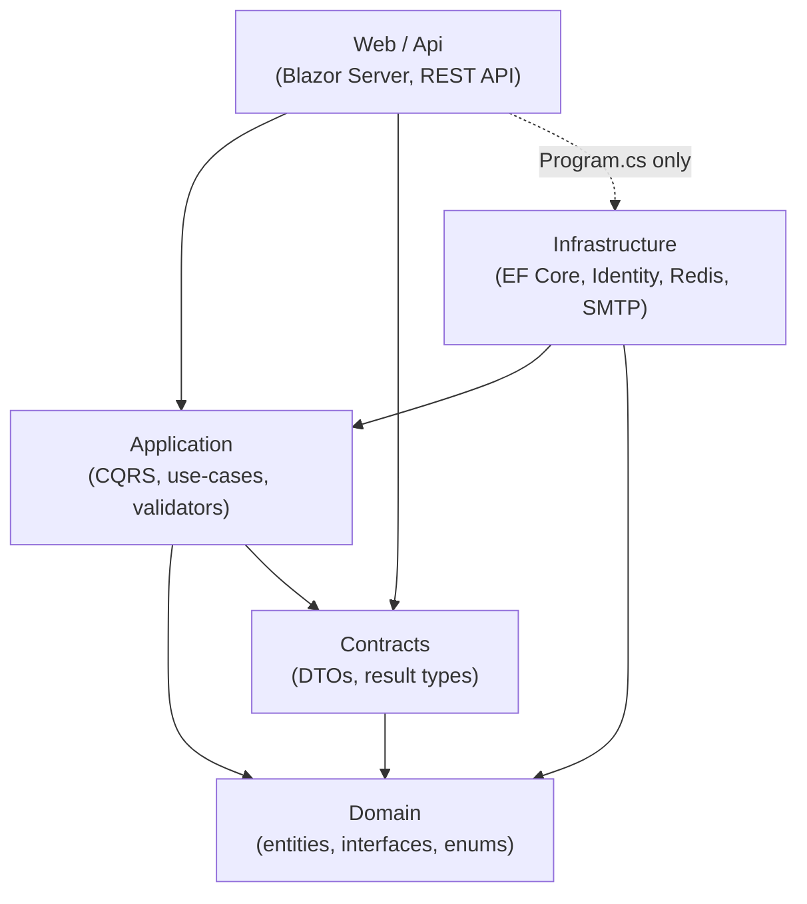
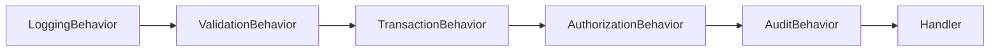
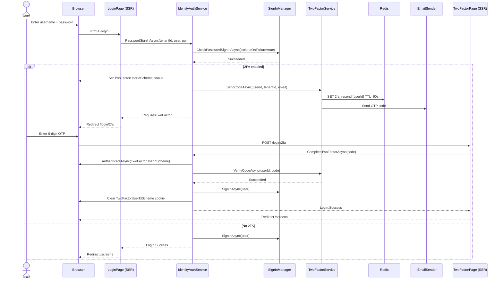
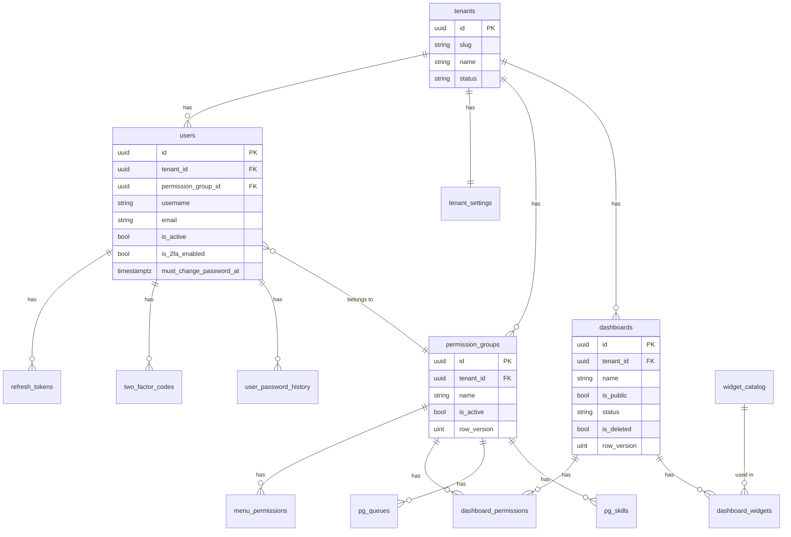

# RTM View Shell — Architecture Diagrams

## C4 Context

## C4 Container

## Dependency Rules (Clean Architecture)

## MediatR Pipeline

## Login + 2FA Sequence

## ER Diagram (Core Entities)

