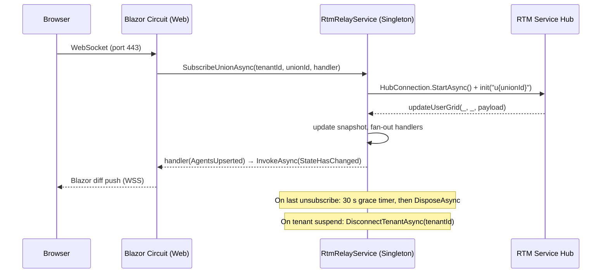

# Docs update — CC-003 RTM Relay Architecture

**Session name:** RTM — Docs CC-003
**Scope:** Update 3 text files, commit. No code changes.

---

## §0 — Session-resume integrity check

```bash
cd "D:\Claude\Projects\RTM View Shell"
git status --short
```

CHANGELOG.md, docs/architecture/widget-framework.md, docs/diagrams/architecture.md
должны отсутствовать в списке M (на HEAD).

---

## Шаг 1 — docs/architecture/widget-framework.md

Файл: `docs/architecture/widget-framework.md`

**Изменение 1:** Заменить в заголовке `v1.3` на `v1.6`.

**Изменение 2:** Найти блок `### 6.2 External: per-tenant widget feed URL`
и заменить его целиком (до следующей `---`) новым текстом:

```
### 6.2 RTM Relay — single-port data feed (CC-003, 2026-05-31)

**Previous design (two-port model, superseded):** the widget library opened a second
WebSocket directly to RTM Service on a separate port. This required RTM Service to
be publicly reachable from every client browser — impractical in corporate CC networks.

**Current design — Shell as relay (CLAUDE.md §34):**

```
Browser
  └── WSS (port 443) ──▶ Kestrel/Shell
                              │ in-process
                        RtmRelayService  (Singleton)
                              │ server-to-server, internal network
                        HubConnection ──▶ RTM Service SignalR Hub
```

The shell registers `RtmRelayService` as a **Singleton**. It maintains one `HubConnection`
per `(TenantId, UnionId)` and `(TenantId, GridId)` — shared across all Blazor circuits.
When RTM Service pushes a message, `RtmRelayService` fans it out to all registered
subscriber handlers in-process.

**Blazor Server widget components** subscribe directly:

```csharp
@inject IRtmRelayService RtmRelay

// OnInitializedAsync:
_handler = async change => await InvokeAsync(() => { ApplyChange(change); StateHasChanged(); });
await RtmRelay.SubscribeUnionAsync(TenantId, unionId, _handler, ct);

// DisposeAsync:
await RtmRelay.UnsubscribeUnionAsync(TenantId, unionId, _handler);
```

**JS / external widget clients** connect to the shell hub:

```javascript
const conn = new signalR.HubConnectionBuilder().withUrl("/hubs/rtm-relay").build();
conn.on("unionUpdate", handler);
conn.on("gridUpdate",  handler);
await conn.start();
await conn.invoke("subscribeUnion", unionId);
```

Hub URL per tenant is configured in `tenant_settings.SignalRConnectionUrl`.
Redis cache: `{tenantId}:rtm:hub_url` (TTL 5 min).

**RTM Hub protocol (server sends):**

| Method | Parameters | Notes |
|---|---|---|
| `updateUserGrid` | `(JsonElement, JsonElement, JsonElement)` | 3 params; only 3rd (payload) used |
| `removeUser` | `(JsonElement, JsonElement)` | 2nd param = `[{"name":"loginName"}]` |
| `updateGridData` | `JsonElement` | Array `[{CellId, Value}]` |

Always use `JsonElement` — typed parameters cause silent message drops.
DataGrid requires `init` + `refreshCells` on connect; `init` alone gives no initial push.

**Ref-count + grace timer:** connection stays alive for 30 s after the last
subscriber unsubscribes (handles page navigation without reconnecting).

**Tenant lifecycle:** `DisconnectTenantAsync(tenantId)` disconnects all active
connections for a tenant — called when tenant is Suspended or Deleted.
```

**Изменение 3:** Найти строку OQ-W-04:
```
| OQ-W-04 | How does widget library authenticate to backend SignalR hub? | Open (ADR-004 OQ-1) |
```
Заменить на:
```
| OQ-W-04 | How does widget library authenticate to backend SignalR hub? | **Resolved (CC-003):** Blazor components inject `IRtmRelayService` directly; JS clients use `/hubs/rtm-relay` with the same Identity cookie. |
```

**Запись через Python с os.fsync(), проверка:**
```bash
sync && tail -3 docs/architecture/widget-framework.md
grep -c "RTM Relay" docs/architecture/widget-framework.md
# Expected: >= 3
```

---

## Шаг 2 — docs/diagrams/architecture.md

Файл: `docs/diagrams/architecture.md`

**Изменение 1 — C4 Context:** найти строку:
```
    Rel(shell, sso, "OIDC / SAML2 / LDAP")
```
Добавить после неё (перед закрывающим ` ``` `):
```
    System_Ext(rtm, "RTM Service", "Windows Service; collects real-time CC data; exposes SignalR hub (internal network only)")
    Rel(shell, rtm, "SignalR client (server-to-server, internal)")
```

**Изменение 2 — C4 Container:** найти строки:
```
    Rel(bg, postgres, "TCP")
    Rel(bg, redis, "TCP")
```
(последние две Rel в блоке C4Container)
Добавить после них (перед закрывающим ` ``` `):
```
    Container(relay, "RtmRelayService", "Singleton (.NET 8)", "Server-side SignalR client to RTM Service; fans out real-time data to Blazor widgets in-process (CLAUDE.md §34)")
    System_Ext(rtm, "RTM Service", "Windows Service", "Collects CC real-time data; exposes SignalR hub on internal network")
    Rel(relay, rtm, "WSS (internal)", "SignalR client — HubConnection per (TenantId, UnionId/GridId)")
    Rel(web, relay, "in-process", "IRtmRelayService.SubscribeUnionAsync / SubscribeGridAsync")
```

**Изменение 3:** Добавить в конец файла новую секцию:

```markdown
## RTM Relay — data flow sequence


```

**Проверка:**
```bash
sync && tail -3 docs/diagrams/architecture.md
grep -c "RtmRelayService" docs/diagrams/architecture.md
# Expected: >= 2
```

---

## Шаг 3 — CHANGELOG.md

Файл: `CHANGELOG.md`

Добавить новую секцию в начало (сразу после первого блока `---`):

```markdown
## [1.6.0] — 2026-05-31

### Summary

RTM Relay Infrastructure (CC-003): single-port browser model replacing the
two-port design. Shell now acts as a server-side SignalR client to RTM Service;
browsers only need one connection (port 443).

### Added

- `IRtmRelayService` (Application layer) — subscribe/unsubscribe per `(TenantId, UnionId/GridId)`
- `RtmRelayService` (Infrastructure, Singleton) — `HubConnection` per `(TenantId, UnionId)` and
  `(TenantId, GridId)` with ref-count, 30 s grace timer, in-memory snapshot, reconnect backoff
- Domain models: `CellValue`, `AgentSnapshot`, `UnionStateChange`, `GridCellUpdate`
- `RtmRelayHub` — browser-facing `/hubs/rtm-relay` for JS / external widget clients
- `DisconnectTenantAsync(tenantId)` — called on tenant Suspend/Delete

### Changed

- `DI`: `AddSingleton<IRtmRelayService, RtmRelayService>()` + `MapHub<RtmRelayHub>` in Program.cs
- `tenant_settings.SignalRConnectionUrl` — existing field, now used by `RtmRelayService`
- Architecture docs updated: widget-framework.md §6.2, diagrams/architecture.md

### Architecture note

Previous design required browser to open two WebSockets (Shell port 443 + RTM Service port N).
New design: one WebSocket (port 443) only. RTM Service is internal-network only.
See CLAUDE.md §34.

---

```

**Проверка:**
```bash
sync && head -5 CHANGELOG.md
# Expected: первая версия = [1.6.0]
```

---

## MANDATORY pre-commit check

```bash
bash tools/pre-commit-check.sh CHANGELOG.md docs/architecture/widget-framework.md docs/diagrams/architecture.md
```

Если exit code 1 — НЕ делать commit.

---

## Git commit

```bash
git add CHANGELOG.md docs/architecture/widget-framework.md docs/diagrams/architecture.md

git commit -m "docs(CC-003): update architecture docs for RTM Relay pattern

- CHANGELOG: add [1.6.0] entry for CC-003 RTM Relay Infrastructure
- widget-framework.md: rewrite §6.2 (relay pattern, RTM Hub protocol,
  Blazor + JS integration); close OQ-W-04; version 1.3→1.6
- architecture.md: C4 Context/Container add RTM Service + RtmRelayService;
  add RTM Relay sequence diagram"
```

---

## MANDATORY post-commit verification

```bash
git status --short
git diff HEAD -- CHANGELOG.md docs/architecture/widget-framework.md docs/diagrams/architecture.md
git show HEAD:CHANGELOG.md | head -3
```

---

## MANDATORY re-sync (PD-007)

```bash
for f in CHANGELOG.md docs/architecture/widget-framework.md docs/diagrams/architecture.md; do
    git show HEAD:"$f" > "$f"
    echo "Re-synced: $f ($(wc -l < "$f") lines)"
done
sync
```
